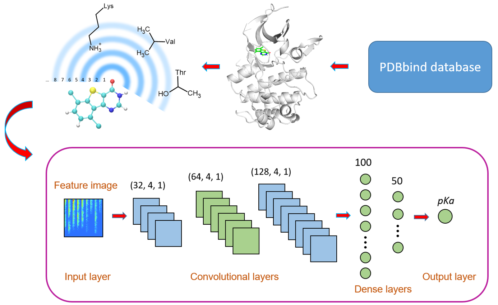

# OnionNet-2
OnionNet-2 is constructed based on convolutional neural network (CNN) to predict the protein-ligand binding affinity. One of the greatest advantages of OnionNet-2 is that it can achieve higher accuracy at a lower computational cost. When taking CASF-2016 and CASF-2013 as benchmark, OnionNet-2 shows strong scoring power.

## Contact
Zechen Wang, Shandong University, zechenwang@mail.sdu.edu.cn

## Citation
<a href='https://www.frontiersin.org/articles/10.3389/fchem.2021.753002/full'>Wang Z, Zheng L, Liu Y, et al. OnionNet-2: A Convolutional Neural Network Model for Predicting Protein-Ligand Binding Affinity based on Residue-Atom Contacting Shells. Front Chem 2021, 9, 753002. </a>

## Installation
First, create a conda environment and install some necessary packages for running OnionNet-2.

    python >= 3.8
    tensorflow==2.3 or tensorflow-gpu==2.3
    pandas==1.3.4
    scikit-learn==0.22.1
    joblib==1.0.1
    numpy==1.18.5
    scipy==1.4.1

## Usage
### 1. Predicting the affinity of a protein-ligand complex using OnionNet-2.
First, you should download the [model](https://zenodo.org/records/10728089) file and save it to the "models" directory. Then, you should prepare the protein file (.pdb format) and the ligand file (.pdb format) to be predicted. Usually the structure files of ligands are in sdf or mol2 format, and you can generate pdb files through openbabel. The openbabel installation command is as follows:

    conda install -c conda-forge openbabel
   
The usage of openbabel is as follows:
   
    obabel ligand.sdf -O ligand.pdb
    
We provide the "predict.py" script in the "scoring" directory, you can score protein-ligand complexes using the following command:
    
    python predict.py \
	-rec_fpath $rec_fpath \
	-lig_fpath $lig_fpath \
	-shape 84,124,1 \
	-scaler $scaler_fpath \
	-model $model_fpath \
	-shells 62 \
	-out_fpath $out_fpath

rec_fpath and lig_fpath are the paths to the protein and ligand files, while model_fpath and scaler_fpath are the paths to the model and scaler files, respectively. The final predicted affinity is stored in the out_fpath file. We can also provide a shell script "run_predict.sh" in the "scoring" directory. You can run "bash run_predict.sh" to score the complex.

### 2. Retrain OnionNet-2
In the "retrain" directiry, we provide the necessary scripts for training OnionNet-2. First, you need to prepare the data sets (training set and validation set) through the "generate_features.py" file:

    python generate_features.py \
        -inp inputs.dat \
        -out samples_features.pkl \
        -shells 62

Within the "inputs.dat" file, each line provides the name and path of a protein-ligand complex. The format is as follows:

    1c5z    ../samples/1c5z/1c5z_protein.pdb    ../samples/1c5z/1c5z_ligand.pdb
    1bzc    ../samples/1bzc/1bzc_protein.pdb    ../samples/1bzc/1bzc_ligand.pdb

"samples_features.pkl" is the output feature file. You can also run "bash run_generate-features.sh" to test this process. After generating the training set and validation set, you can train your model using the "train.py" script. For usage and related parameters of "train.py", refer to the "run_training.sh" script.